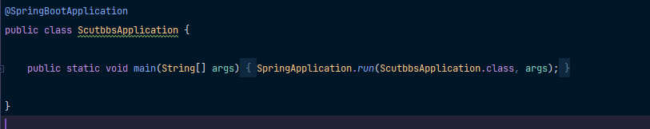
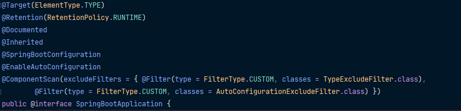

# 项目学习文档
# 设计部分

# 学习部分
## Spring FrameWork

### Spring core
Spring容器里的对象称为bean
#### IoC
IoC是管理对象的一种思想，它是基于面向对象的。

IOC是控制反转的意思。通常来说，我们都是在类的内部主动去new来创建对象。这样做的缺点是，创建的对象耦合度比较高。
“解耦”是软件工程里永远追寻的目标。

故提出了控制翻转这样的一个思想。 就是借助第三方（IoC容器）来实现对具有依赖关系的对象进行解耦。
有了IoC容器之后，把创建和查找对象的职责委托给IoC容器，由容器来进行注入组合对象，所以对象和对象直接的联系是松散的。
控制翻转的过程就是获取对象的过程，被翻转了。由原本主动去创建对象，获取对象，翻转成IoC容器注入对象。

DI——Dependency Injection 依赖注入，这理解为IoC这种思想的实现方式。

IoC Container —— IoC容器，它是依赖注入实现的关键，本质上可以理解为是一个Factory

Spring 实现IoC的方式如下图：

Spring中实现IoC容器的主要的包是：`org.springframework.beans`和`org.springframework.context`。主要的接口：`BeanFactory`提供了一种高级的配置机制，能够管理任何类型的对象。而`ApplicationContext`是`BeanFactory`的子接口，它提供了更多企业级的具体功能。

`org.springframework.context.ApplicationContext`代表了Spring的IoC容器。它负责实例化，配置，组装bean，过程就是上图所示，这些过程除了具体的bean之外就是我们的Metadata，这些Metadata获取的方式常见的就是XML文件或者注解。

##### Configuration Metadata

Configuration Metadata一般来说是使用xml文件的形式来告诉Spring的IoC容器，因为通过XML文件配置，会比直接硬编码的形式更加解耦。IoC只需要读入文件即可。但是我一般是选用注解来完成Configuration Metadata的注入。

### 

#### AOP
AOP也是管理对象的一种思想，它是基于面向切面的。

#### 常用的注解

`@SpringBootApplication`

这个注解通常出现在启动类上

它主要是由以下这些注解实现的

由这些注解，其实是定义了这个启动类是一个配置类，我们正式环境中的配置都是由此出现的。

那么SpringBoot项目启动时，**都做了些什么？**（TODO）

可以看到SpringBoot中之所以可以减少那么多配置都是由`@EnableAutoConfiguration`这个注解实现的。

`@SpringBootTest`

通常作用于一个类，说明这是一个测试类

`@ContextConfiguration(classes = ScutbbsApplication.class)`

通常作用于一个类，一般是一个启动类，说明使用的配置类与ScutbbsApplication一致。可以用在测试类上，使得测试环境的配置类与正式环境一致。

`ApplicationContextAware`——这个是一个接口，如果为了得到IoC容器，实现ApplicationContextAware这个接口的*setApplicationContext*方法。

`@Test`

通常作用于一个函数上，表明这是一个测试函数。

`@Component`

标注Spring管理的Bean。这样在Spring启动的时候会自动扫描，加入IoC容器中。

`@controller`

标注这是一个controller层的Bean，本质是一个Component

`@RequestMapping("/alpha")`

用来来映射URL注解 @RequestMapping 可以用在类定义处和方法定义处。

类定义处：规定初步的请求映射，相对于web应用的根目录；

方法定义处：进一步细分请求映射，相对于类定义处的URL。如果类定义处没有使用该注解，则方法标记的URL相对于根目录而言。

除了映射URL之外，还可以制定请求的类型: GET. POST. DELTE. PUT

`@ResponseBody`

@ResponseBody表示方法的返回值直接以指定的格式写入Http response body中，而不是解析为跳转路径。

`@RestController`

@RestController的作用等同于@Controller + @ResponseBody。如果要求方法返回的是json格式数据，而不是跳转页面，可以直接在类上标注@RestController，而不用在每个方法中标注@ResponseBody，简化了开发过程。

`@service`

这是一个service层的Bean，本质是一个Component

`@repository`

这是一个dao层的Bean，本质是一个Component

`@Configuration`

标注这是一个配置类。

`@Primary`

用来标注一个Bean，获取优先装配的资格。

`@Scope`

用来表明这个Bean的创建机制，默认是Singleton，即该类型的Bean都是为同一个对象。如果是Prototype，就会创建多个对象

`@Bean`

用于显示声明单个bean，而不是像`@Component`注解一样，让Spring自动执行管理Bean。它将bean的声明与类定义分离，并允许您精确地创建和配置bean。如果想将第三方的类变成组件，你又没有没有源代码，也就没办法使用`@Component`进行自动配置，这种时候使用`@Bean`就比较合适了。

`@Autowired	`

依赖注入的注解，作用在属性，setter，构造器上，可以使Bean注入到属性中，默认是byType。目前版本不建议使用(Spring > 5)，一般都是使用构造器注入。

`Resource`

这个注解并不是Spring所提供的依赖注入注解。但是它也可以用来装配Bean，也可也作用在属性，setter,默认是byName

`@Qualifier`

依赖注入的注解，用于注入特定某个名称的Bean

### Spring Data Access
Spring访问数据库的功能
#### Transaction 事务
#### Spring-Mybatis 半ORM框架
### Web Servlet
#### Spring MVC

### Integration
使用Spring去发邮件，消息队列，安全控制，定时任务等。
